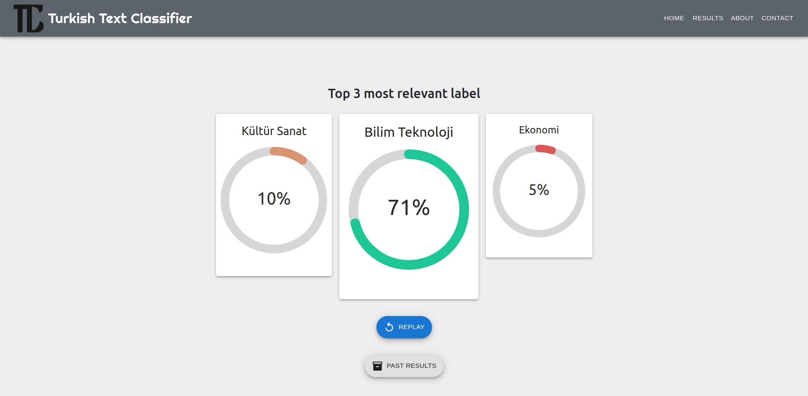

# Turkish Text-Classifier Application

<a href="#"></a>
<a href="#"></a>
<a href="#"></a>
<a href="#"></a>
<a href="#"></a>




Tuskish Text Classifier application to determine the topic of the input string. The model itself is a fine-tuned version of the BERT, Electra, DistilBERT.

# How to run the app?

- Clone the repository.
- Make sure you have docker and docker-compose in your environment.
- Navigate to the app folder.
- Run the following docker command.

```ruby
docker-compose up --build
```
- Wait until you see the initialization of the app.

```ruby
api_1 | INFO: Application startup complete.
```

- Navigate the following url in any web browser to reach the React app.

```ruby
http://localhost:3000/
```
