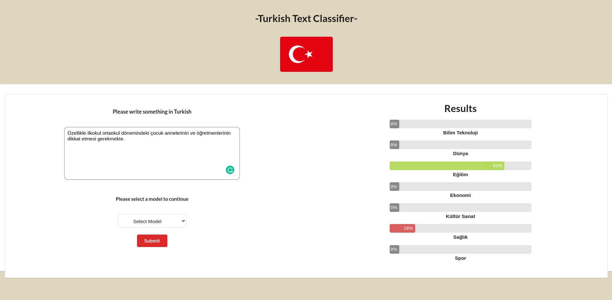

# Turkish-Text-Classifier-App



Tuskish Text Classifier application to determine the topic of the input string. The model itself is a fine-tuned version of the BERT model.

# How to run the app?

- Clone the repository.
- Make sure you have docker and docker-compose in your environment.
- Navigate to the app folder.
- Run the following docker command.

```ruby
docker-compose up --build
```
- Navigate the following url in any web browser.

```ruby
http://0.0.0.0:8080/
```
